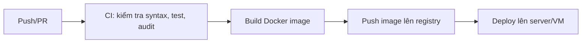

# CardioGuard

CardioGuard là một prototype dashboard giám sát tim mạch thời gian thực, được xây dựng bằng FastAPI, WebSocket, TensorFlow/Keras và giao diện web tĩnh.

Dự án mô phỏng luồng dữ liệu từ CSV demo hoặc wearable, đưa qua mô hình AI, rồi hiển thị cảnh báo trực quan trên dashboard và gửi thông báo Telegram khi cần.

## Mục tiêu

- Theo dõi nhịp tim, SpO2 và nhịp thở theo thời gian thực.
- Dự đoán risk score bằng mô hình ML đa đầu vào.
- Cảnh báo sớm khi các chỉ số vượt ngưỡng.
- Lưu lịch sử cảnh báo vào SQLite.
- Hỗ trợ tư vấn y tế ngắn gọn qua Groq.

## Tính năng chính

- Dashboard real-time với Chart.js.
- WebSocket stream dữ liệu mô phỏng từ CSV.
- Mô hình Keras/TensorFlow đánh giá cửa sổ 60 giây.
- Lịch sử cảnh báo lưu trong SQLite.
- Gửi cảnh báo Telegram khi ở trạng thái warning/alarm.
- Endpoint chatbot y tế qua Groq.
- Chạy được trên local hoặc bằng Docker.

## Kiến trúc và pipeline

### Pipeline xử lý dữ liệu

```mermaid
flowchart LR
    A[CSV demo hoặc wearable] --> B[WebSocket stream]
    B --> C[Backend FastAPI]
    C --> D[Buffer 60 giây]
    D --> E[Chuẩn hoá bằng scaler]
    E --> F[Mô hình Keras/TensorFlow]
    F --> G[Risk score]
    G --> H{Ngưỡng cảnh báo}
    H -->|Bình thường| I[Dashboard xanh]
    H -->|Cảnh báo| J[Dashboard vàng + Telegram]
    H -->|Báo động| K[Dashboard đỏ + Telegram]
    G --> L[SQLite history.db]
    C --> M[/api/chat]
    M --> N[Groq chatbot]
```

### Pipeline triển khai đề xuất trên GitHub



> Repository hiện đã có `Dockerfile` và `docker-compose.yml`, nhưng chưa có workflow GitHub Actions. Sơ đồ trên là pipeline đề xuất nếu bạn muốn bổ sung CI/CD sau khi push lên GitHub.

## Cấu trúc thư mục

```text
Wearable_Cardio_Project/
README.md
Dockerfile
docker-compose.yml
.gitignore
.dockerignore
backend/
  main.py
  requirements.txt
  .env.example
  core/
    __init__.py
    ai_chatbot.py
    ai_engine.py
    database.py
    notifier.py
  data/
    patient_demo_stream.csv
  models/
    cardio_CNNLSTM_model.h5
frontend/
  index.html
  script.js
  style.css
```

## Công nghệ sử dụng

- Backend: FastAPI, Uvicorn, WebSocket
- AI/ML: TensorFlow, Keras, scikit-learn, NumPy, pandas
- Lưu trữ: SQLite
- Frontend: HTML, CSS, JavaScript, Chart.js
- Tích hợp ngoài: Groq API, Telegram Bot API
- Đóng gói: Docker, Docker Compose

## Yêu cầu hệ thống

- Python 3.11+ khi chạy local.
- Docker Desktop nếu chạy bằng container.
- Internet nếu sử dụng Groq API hoặc Telegram.

## Thiết lập biến môi trường

Tạo file `backend/.env` từ mẫu `backend/.env.example`:

```ini
GROQ_API_KEY=your_groq_api_key_here
GROQ_MODEL=llama-3.3-70b-versatile
TELEGRAM_TOKEN=your_telegram_bot_token_here
TELEGRAM_CHAT_ID=your_chat_id_here
PATIENT_ID=PT-2024-089
```

## Chạy local

### 1. Tạo virtual environment

```powershell
python -m venv .venv
.venv\Scripts\activate
```

### 2. Cài dependencies

```powershell
pip install -r backend/requirements.txt
```

### 3. Chạy ứng dụng

```powershell
cd backend
python main.py
```

Hoặc:

```powershell
uvicorn main:app --host 127.0.0.1 --port 8000
```

Mở trình duyệt tại:

```text
http://127.0.0.1:8000
```

## Chạy bằng Docker

### Cách 1: docker run

```powershell
docker build -t cardioguard .
docker run --rm -p 8000:8000 --env-file backend/.env cardioguard
```

### Cách 2: Docker Compose

```powershell
docker compose up --build
```

Mở trình duyệt tại:

```text
http://127.0.0.1:8000
```

## API chính

- `GET /` - Trang dashboard
- `GET /style.css` - CSS tĩnh
- `GET /script.js` - JavaScript tĩnh
- `GET /api/history` - Lịch sử cảnh báo gần nhất
- `POST /api/chat` - Gửi câu hỏi tới chatbot
- `ws://<host>/ws` - WebSocket stream dữ liệu real-time

## Luồng hoạt động

1. Client mở dashboard và kết nối WebSocket.
2. Backend phát dữ liệu demo từ file CSV.
3. Dữ liệu được gom vào buffer 60 giây.
4. Buffer được chuẩn hoá bằng scaler trước khi đưa vào model.
5. Mô hình trả về risk score.
6. Backend phân loại bình thường, cảnh báo hoặc báo động và gửi dữ liệu về frontend.
7. Nếu cần, hệ thống lưu lịch sử và gửi cảnh báo Telegram.

## Kiểm tra bảo mật trước khi push lên GitHub

Các điểm đã được xác nhận:

- File `.env` đã bị loại trừ trong `.gitignore`.
- `history.db`, virtual environment, log và các file runtime đều bị ignore.
- `backend/.env.example` chỉ chứa giá trị mẫu, không có secret thật.
- Không thấy API key hoặc token hardcode trong source.
- Docker chạy đúng với port mapping tới `127.0.0.1:8000` trên máy host.

Lưu ý:

- Khi load scaler, có thể xuất hiện cảnh báo `InconsistentVersionWarning` nếu scaler được tạo bằng phiên bản scikit-learn khác. Cảnh báo này không làm dừng ứng dụng, nhưng nên tái tạo scaler bằng cùng phiên bản để kết quả ổn định hơn.
- Môi trường hiện tại chưa chạy được full `pip-audit`, vì vậy nên thêm bước audit dependency vào CI trước khi dùng cho production.

## Xử lý lỗi thường gặp

- Nếu `http://127.0.0.1:8000` không mở được, hãy kiểm tra container còn đang chạy không.
- Nếu chạy Docker, hãy chắc chắn đã map port `8000:8000`.
- Nếu chatbot không phản hồi, kiểm tra `GROQ_API_KEY` trong `backend/.env`.
- Nếu Telegram không gửi cảnh báo, kiểm tra `TELEGRAM_TOKEN` và `TELEGRAM_CHAT_ID`.
- Nếu thấy `0.0.0.0:8000` trong log, đó là địa chỉ bind nội bộ của Uvicorn; trên trình duyệt vẫn phải dùng `http://127.0.0.1:8000` hoặc `http://localhost:8000`.

## Hướng phát triển tiếp

- Thêm GitHub Actions để kiểm tra syntax, chạy test, build Docker image và audit dependency.
- Tạo lại scaler bằng đúng phiên bản scikit-learn để bỏ cảnh báo version mismatch.
- Nếu cần production hơn, có thể tách frontend thành static hosting riêng.

## Tuyên bố

Đây là ứng dụng minh hoạ kỹ thuật, không phải công cụ chẩn đoán y khoa. Mọi quyết định lâm sàng phải do chuyên gia y tế có thẩm quyền thực hiện.
