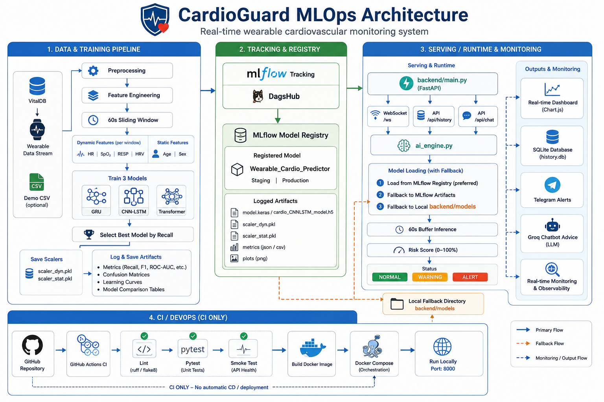
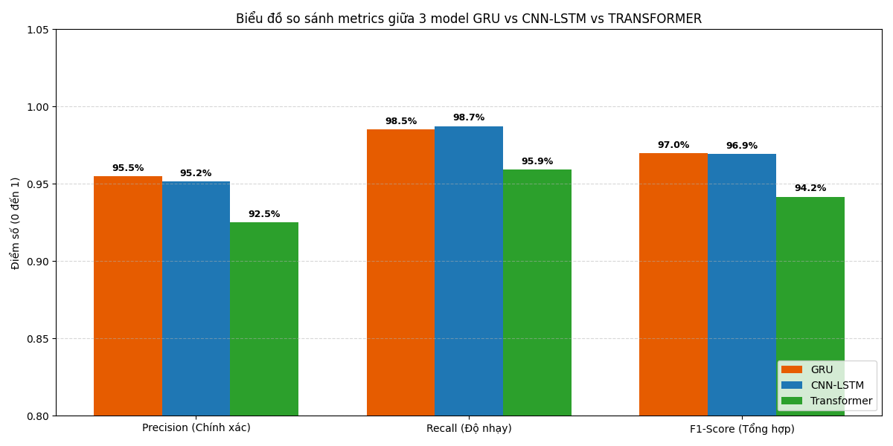

# CardioGuard — Giám sát Tim mạch Thử nghiệm

CardioGuard là một dự án prototype cho hệ thống giám sát các chỉ số tim mạch thu thập từ wearable hoặc dữ liệu mô phỏng. Mục tiêu của dự án là minh họa một pipeline MLOps đơn giản: thu dữ liệu thời gian thực → chuẩn hoá → dự đoán bằng mô hình Keras → hiển thị dashboard real-time và gửi cảnh báo (Telegram) khi cần.

Mục tiêu README này: mô tả ngắn gọn đề tài, hướng dẫn cài đặt và chạy trên máy local hoặc trong Docker, và cung cấp các bước xử lý khi gặp lỗi phổ biến.

## Hình minh họa

### Kiến trúc MLOps



### So sánh 3 mô hình train



## Kiến trúc hệ thống

CardioGuard được tổ chức theo luồng MLOps ngắn gọn như sau:

1. **Data & Training**: dữ liệu VitalDB / demo CSV được tiền xử lý, tạo đặc trưng động - tĩnh, chia cửa sổ 60 giây, rồi huấn luyện 3 mô hình GRU, CNN-LSTM và Transformer.
2. **Tracking & Registry**: model tốt nhất, scalers và biểu đồ đánh giá được ghi nhận qua MLflow và DagsHub, sau đó đăng ký vào MLflow Model Registry dưới tên `Wearable_Cardio_Predictor`.
3. **Serving & Monitoring**: backend FastAPI nạp model từ Registry hoặc fallback về artifact/local model, chạy WebSocket real-time, ghi lịch sử vào SQLite, hiển thị dashboard và gửi cảnh báo Telegram.

Luồng chính: **Data → Training → MLflow Registry → FastAPI Serving → Dashboard / Alerting**.

## Tổng quan chức năng
- Stream dữ liệu demo hoặc stream từ thiết bị.
- Gom cửa sổ 60s, chuẩn hoá bằng scaler rồi đưa vào mô hình Multi-Input (dynamic + static features).
- Trả về risk score (0–100%) và hiển thị trên dashboard (Chart.js).
- Lưu lịch sử cảnh báo vào SQLite (`backend/history.db`).
- Gửi cảnh báo qua Telegram; hỗ trợ chatbot ngắn qua Groq API.
- Hỗ trợ tải model & artifacts từ MLflow Registry (DagsHub) hoặc dùng file local.

## Tệp và vị trí quan trọng
- Mã backend: [backend/main.py](backend/main.py#L1)
- Engine AI: [backend/core/ai_engine.py](backend/core/ai_engine.py#L1)
- Database: [backend/core/database.py](backend/core/database.py#L1)
- Frontend tĩnh: [frontend/index.html](frontend/index.html#L1), [frontend/script.js](frontend/script.js#L1)
- Mẫu biến môi trường: [backend/.env.example](backend/.env.example#L1)
- Dependencies: [backend/requirements.txt](backend/requirements.txt#L1)
- Docker: [Dockerfile](Dockerfile#L1), [docker-compose.yml](docker-compose.yml#L1)

## Cấu trúc thư mục project

```text
Wearable_Cardio_Project/
├── README.md
├── MLOps.png
├── 3models.png
├── Dockerfile
├── docker-compose.yml
├── .github/
│   └── workflows/
│       └── ci.yml
├── backend/
│   ├── main.py
│   ├── requirements.txt
│   ├── .env.example
│   ├── core/
│   │   ├── ai_chatbot.py
│   │   ├── ai_engine.py
│   │   ├── database.py
│   │   └── notifier.py
│   ├── data/
│   │   └── patient_demo_stream.csv
│   └── models/
│       └── cardio_CNNLSTM_model.h5
└── frontend/
    ├── index.html
    ├── script.js
    └── style.css
```

## Yêu cầu
- Python 3.11
- Docker (nếu chạy container)
- Quyền truy cập Internet nếu sử dụng Groq/Telegram/MLflow Registry

## Thiết lập nhanh (Local)
1. Clone repository và chuyển tới thư mục project.

2. Tạo virtual environment và cài dependency:

```powershell
python -m venv .venv
.venv\Scripts\Activate.ps1
pip install -r backend/requirements.txt
```

3. Tạo file môi trường từ mẫu và chỉnh thông số cần thiết:

```powershell
copy backend\.env.example backend\.env
```

4. Chạy server:

```powershell
cd backend
python main.py
# hoặc
uvicorn main:app --host 0.0.0.0 --port 8000
```

Mở `http://127.0.0.1:8000` để truy cập dashboard.

## Chạy bằng Docker
- Build image và chạy (CLI):

```powershell
cd <project-root>
docker build -t cardioguard .
docker run --rm -p 8000:8000 --env-file backend/.env cardioguard
```

- Hoặc dùng Docker Compose (khuyến nghị cho dev):

```powershell
cd <project-root>
docker compose up --build
```

Lưu ý: `docker-compose.yml` đã cấu hình để đọc `backend/.env` (env_file). Nếu muốn chỉ định trực tiếp, bạn vẫn có thể dùng `docker compose --env-file backend/.env up --build`.

## MLflow (Registry / Artifacts)
- Nếu bạn muốn backend tự tải model từ MLflow Registry (ví dụ: DagsHub), cấu hình các biến trong `backend/.env`:

- `USE_MLFLOW=true`
- `MLFLOW_TRACKING_URI` (ví dụ DagsHub tracking URI)
- `MLFLOW_MODEL_URI` (ví dụ `models:/Wearable_Cardio_Predictor/latest`)
- `MLFLOW_TRACKING_USERNAME`, `MLFLOW_TRACKING_PASSWORD` (nếu cần)
- `MLFLOW_RUN_ID` (tùy chọn — dùng để tải artifacts cụ thể như scaler)

Hệ thống ưu tiên:
1) tải model trực tiếp từ Registry nếu `MLFLOW_MODEL_URI` được cung cấp; 2) fallback tải artifacts từ `MLFLOW_RUN_ID`; 3) nếu không có, dùng file local `backend/models/`.

## Biến môi trường (tóm tắt)
- `USE_MLFLOW` — bật/tắt tải model từ MLflow
- `MLFLOW_TRACKING_URI`, `MLFLOW_TRACKING_USERNAME`, `MLFLOW_TRACKING_PASSWORD`
- `MLFLOW_MODEL_URI`, `MLFLOW_RUN_ID`
- `TELEGRAM_TOKEN`, `TELEGRAM_CHAT_ID` — tích hợp Telegram
- `GROQ_API_KEY`, `GROQ_MODEL` — tích hợp chatbot

Xem `backend/.env.example` để biết đầy đủ biến và giá trị mẫu.

## Kiểm tra nhanh (smoke tests)
- Trong venv cài sẵn dependencies:

```powershell
cd backend
.venv\Scripts\python -c "from core import ai_engine; ai_engine.load_resources(); print('AI engine ready')"
```

Nếu lệnh trên in `AI engine ready` hoặc tương tự mà không lỗi, model/scaler đã nạp thành công.

## Vấn đề thường gặp & cách khắc phục
- Lỗi không tìm thấy model/scaler trong Docker: đảm bảo Compose đọc `backend/.env` hoặc truyền biến MLflow khi chạy. Hoặc đặt file `cardio_CNNLSTM_model.h5`, `scaler_dyn.pkl`, `scaler_stat.pkl` vào `backend/models/` trước khi build image nếu muốn dùng local files.
- Cảnh báo Keras/TensorFlow lúc load model (optimizer/variable mismatch): thường là warning và không chặn; để an toàn nên xuất model/scaler cùng phiên bản thư viện.
- MLflow auth fail: kiểm tra `MLFLOW_TRACKING_USERNAME`/`MLFLOW_TRACKING_PASSWORD` và `MLFLOW_TRACKING_URI`.

## Lưu ý quan trọng
- Ứng dụng này là minh hoạ kỹ thuật, không phải công cụ chẩn đoán y khoa. Mọi quyết định lâm sàng phải do chuyên gia y tế có thẩm quyền thực hiện.

---
